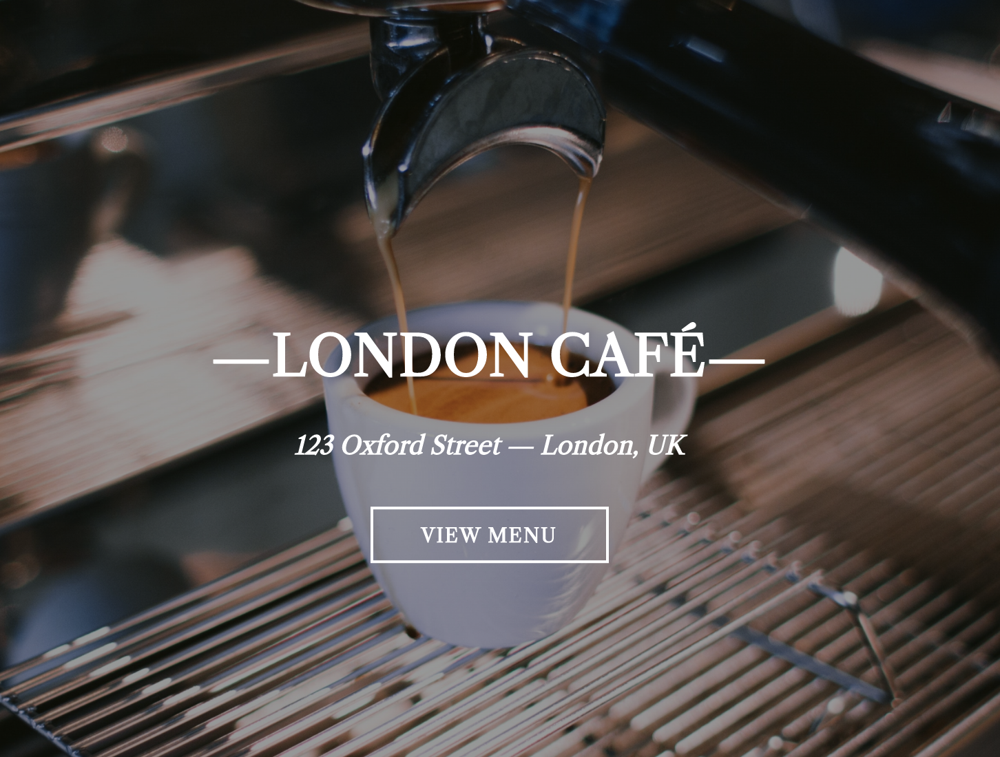
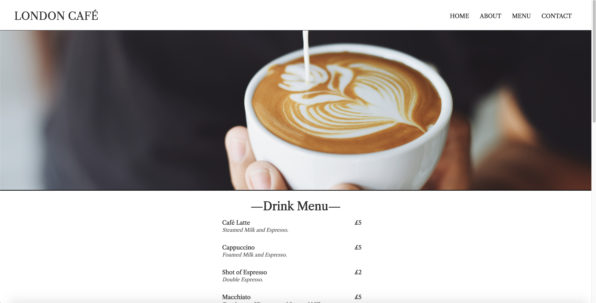

# Restaurant Page

This is a page for a Café in London that was dynamically rendered through JavaScript DOM Manipulation.

> **Home page**

# 

## Table of contents

1. [Demo](#demo)
2. [Technologies](#technologies)
3. [Features](#features)
4. [Development](#development)

## Demo

Here is the working live demo:
[https://jkarjoo.github.io/restaurant-page/](https://jkarjoo.github.io/restaurant-page/).

## Technologies

- Javascript (ES6)
- Webpack
- NPM (Node Package Manager)

## Features

- Home Page
- About Page
- Menu Page
- Contact Page

> **_Menu page_**

# 

## Development

To set up this App locally, clone this repo to your desktop and run `npm install` to install all the dependencies. Then `npm start` to launch the App.
